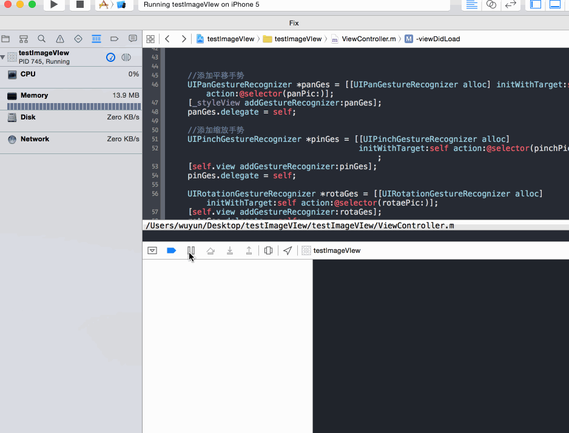

### 变更记录

| 序号 | 录入时间 | 录入人 | 备注 |
|:--------:|:--------:|:--------:|:--------:|
| 1 | 2016-01-08 | Alfred Jiang | - |

### 方案名称

Xcode - 使用 chisel 提高 LLDB 调试效率

### 关键字

Xcode \ 调试 \ 断点 \ 页面 \ 约束

### 需求场景

1. 需要对复杂页面进行调试时

### 参考链接

1. [GitHub - chisel](https://github.com/gkassabli/chisel)
2. [简书 - LLdb篇2教你使用faceBook的chisel来提高调试效率](http://www.jianshu.com/p/b2371dd4443b)
3. [简书 - 小笨狼的LLDB技巧:chisel](http://www.jianshu.com/p/afaaacc55460/comments/1104670)

### 详细内容

#### 安装

##### 1. 安装 *Homebrew* (如果已经安装了，可以跳过这一步)
>ruby -e "$(curl -fsSL https://raw.githubusercontent.com/Homebrew/install/master/install)"

##### 2. 更新 *Homebrew* (如果已经最新了，可以跳过这一步)
>brew update

##### 3. 通过 *Homebrew* 安装 *chisel*
>brew install chisel

##### 4. 添加 *chisel* 命令至 *~/.lldbinit*
>touch ~/.lldbinit
>echo "command script import /usr/local/opt/chisel/libexec/fblldb.py" >> ~/.lldbinit

##### 5. 更新 *chisel*
>brew upgrade chisel

#### 使用

##### 1. 通过 *pviews* 命令直接查看页面层级关系


##### 2. 通过 *border & unborder* 命令为页面控件添加和删除边框颜色和边框的宽度
```
(lldb)border 0x79ec3140 -c green -w 2
```

##### 3. 通过 *paltrace* 命令查看是否存在 [*Ambiguous Layouts*](https://developer.apple.com/library/tvos/documentation/UserExperience/Conceptual/AutolayoutPG/AmbiguousLayouts.html#//apple_ref/doc/uid/TP40010853-CH18-SW1)（*AMBIGUOUS LAYOUT* 即为约束冲突或不完善位置），该命令相当于对 *View* 调用 *_autolayoutTrace*
```
(lldb) paltrace 
•UIWindow:0x7ff450d2fb50 - AMBIGUOUS LAYOUT
|   •UIView:0x7ff450e14430
|   |   *_UILayoutGuide:0x7ff450d30e90
|   |   *_UILayoutGuide:0x7ff450d31230
|   |   *UIView:0x7ff450d32870- AMBIGUOUS LAYOUT for UIView:0x7ff450d32870.minX{id: 46}

Legend:
    * - is laid out with auto layout
    + - is laid out manually, but is represented in the layout engine because translatesAutoresizingMaskIntoConstraints = YES
    • - layout engine host
```

##### 4. 通过 *alamborder & alamunborder* 命令为 [*Ambiguous Layouts*](https://developer.apple.com/library/tvos/documentation/UserExperience/Conceptual/AutolayoutPG/AmbiguousLayouts.html#//apple_ref/doc/uid/TP40010853-CH18-SW1)（*AMBIGUOUS LAYOUT* 即为约束冲突或不完善位置）控件添加和删除边框颜色和边框的宽度
```
(lldb)alamborder
```

##### 5. 通过 *pinternals* 命令打印对象成员变量( *model* 为某实例对象)
```
(lldb) pinternals model
```

##### 6. 使用 *pkp* 命令打印属性，该命令是 *po* 命令的升级版，*po obj.xxx* 是调用 *getter* 方法，如果没有 *getter* 方法就无法打印了。 pkp obj.xxx 优先调用 *getter* 方法，没有 *getter* 方法会直接查找成员变量。
```
(lldb) pkp self.view
```

##### 7. 通过 *flicker* 命令查看 *View*,将 *View* 闪烁一下，以便于查找 *View* 的位置
```
(lldb) flicker self.subView
```


##### 8. 通过 *caflush* 命令更新 UI, 该命令主要用于通过 LLDB 修改界面控件显示属性之后刷新页面
```
caflush
```

##### 9 通过 *show & hide* 命令显示和隐藏页面显示控件
```
(lldb) show 0x7fe713901f10

(lldb) hide 0x7fe713901f10
```

##### 10. 通过 *visualize* 命令打开mac下的预览app打开我们的图片UIImage, CGImageRef格式的图片，甚至view和layer的图片 
```
(lldb) visualize image
```

##### 更多命令使用请关注 **参考链接**

### 效果图
（无）

### 备注
（无）