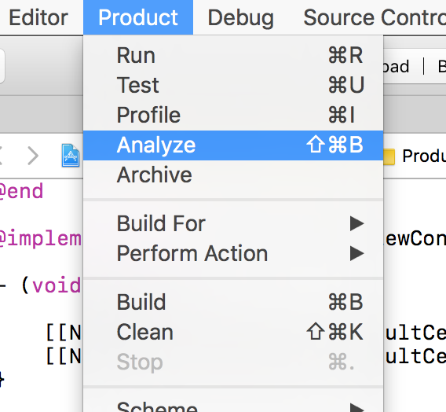

### 变更记录

| 序号 | 录入时间 | 录入人 | 备注 |
|:--------:|:--------:|:--------:|:--------:|
| 1 | 2017-04-08 | [Alfred Jiang](https://github.com/viktyz) | - |

### 方案名称

工具 - 使用 OCLint 进行静态代码分析

### 关键字

工具 \ 静态代码分析

### 需求场景

1. 需要对 Objective-C 代码进行静态代码分析时

### 参考链接

1. [Segmentfault - OCLint 安装与使用](https://segmentfault.com/a/1190000005150573)(推荐)
2. [Segmentfault - OCLint 规则与结果分析](https://segmentfault.com/a/1190000005155260)(推荐)
3. [GitHub - oclint/oclint](https://github.com/oclint/oclint)

### 详细内容

针对 Objective-C 语言的静态代码分析，主要有以下两种方式：

#### 1. 使用 Xcode 的 Analyze （shift + command + B）进行静态代码分析



#### 2. 使用 OCLint 工具

##### 安装

(1) 安装 oclint

通过 Homebrew 安装 oclint

```shell
brew tap oclint/formulae
brew install oclint
```

也可以通过[源码](https://github.com/oclint/oclint)安装 或 [release](https://github.com/oclint/oclint/releases) 包进行 oclint 安装

(2) 安装 xcpretty

```shell
gem install xcpretty
```

##### 升级

```shell
brew update
brew upgrade oclint
```

##### 使用

(1) 清理工程

```shell
xcodebuild clean
```

(2) 编译并输出数据

```shell
xcodebuild | xcpretty -r json-compilation-database
```

(3) 导出分析数据

```shell
cp build/reports/compilation_db.json compile_commands.json
```

(4) 使用 oclint 进行分析导出

```shell
oclint-json-compilation-database -e Pods -- -rc=LONG_LINE=200 -rc=NCSS_METHOD=100 -o=report.html
```

关于 OCLint 规则与结果分析可以参考[这里](https://segmentfault.com/a/1190000005155260)

使用以下 shell 脚本进行一键操作（将该脚本置于与 .xcodeproj 同级目录）

```shell
#! /bin/sh
if which oclint 2>/dev/null; then
    echo 'oclint exist'
else
    brew tap oclint/formulae
    brew install oclint
fi
if which xcpretty 2>/dev/null; then
    echo 'xcpretty exist'
else
    gem install xcpretty
fi
xcodebuild clean
xcodebuild | xcpretty -r json-compilation-database
cp build/reports/compilation_db.json compile_commands.json
oclint-json-compilation-database -e Pods -- -rc=LONG_LINE=200 -rc=NCSS_METHOD=100 -o=report.html
```

### 效果图
（无）

### 备注
（无）


